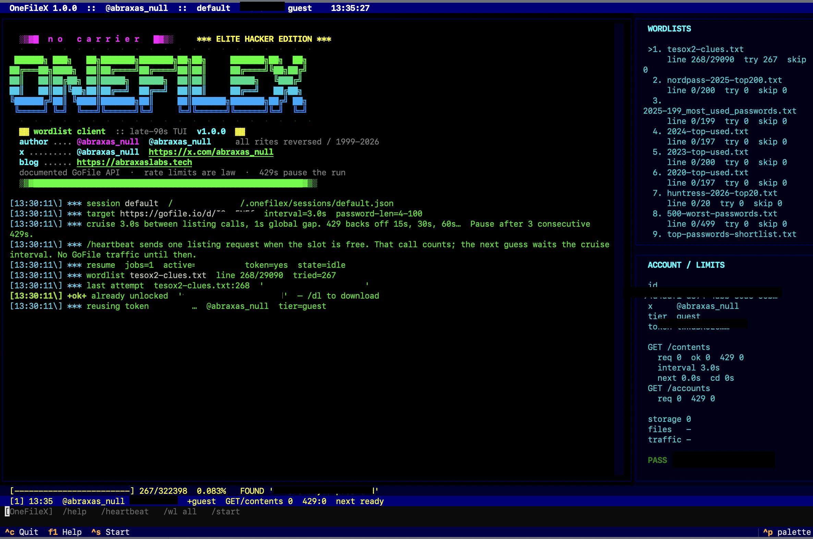

# GoFileX

Late-90s IRC-client TUI for walking wordlists against a password-protected
[GoFile](https://gofile.io) share.

It talks only to the [documented REST API](https://gofile.io/api) and treats
rate limits as a hard rule: sequential requests, a conservative default
interval, exponential cooldown on `429` / `error-rateLimit`, and an automatic
pause after repeated 429s so the client cannot walk into an IP ban.

**Author:** [@abraxas_null](https://x.com/abraxas_null)
· [github.com/abraxas](https://github.com/abraxas)
· [abraxaslabs.tech](https://abraxaslabs.tech)
· [abraxas.null@proton.me](mailto:abraxas.null@proton.me)

**Repo:** [github.com/abraxas/GoFileX](https://github.com/abraxas/GoFileX)



The screenshot is a live session. Share id, API token, account UUID, and
found password are redacted. The hunt that produced it is still live; see
[the notes](docs/this-is-not-your-password.md) and the blog series below.

## Why this exists

[@YogSoth0](https://x.com/YogSoth0/status/2092350368512360711) advertised a
TESO-homage treasure hunt: GoFile first, encrypted binary second. The
GoFile layer is a password-gated public share. The API exposes that gate
as `GET /contents/{id}?password=<sha256-hex>`. GoFileX is the client I
wrote so I could walk that gate without bursting the unpublished listing
quota and earning an IP ban.

Write-up (share password withheld):

1. [Phase 0 — Introduction](https://abraxaslabs.tech/research/hunting-the-fortinet-hunter-0-day)
2. [Phase 1 — The First Door](https://abraxaslabs.tech/research/hunting-the-fortinet-hunter-0-day/the-first-door) — this tool
3. [Phase 2 — The Gate that Wasn't](https://abraxaslabs.tech/research/hunting-the-fortinet-hunter-0-day/the-gate-that-wasnt) — the binary, a different client

Companion notes in this repo:
[docs/this-is-not-your-password.md](docs/this-is-not-your-password.md).

Use this against shares **you own** or have **explicit permission** to
test. Treasure-hunt / CTF rules still count as permission. Tight-looping
`GET /contents` until [GoFile](https://gofile.io) forgets your IP does
not.

## API rules the client follows

From [gofile.io/api](https://gofile.io/api) and the official web client
([`wt.obf.js`](https://gofile.io/js/wt.obf.js),
[`/myprofile`](https://gofile.io/myprofile)):

| Rule | How GoFileX behaves |
|---|---|
| One account, reuse the token | `POST /accounts` once per session; stored in `~/.gofilex/sessions/` |
| `GET /contents/{id}` is **Premium**-badged | Sends the same `X-Website-Token` the official web client uses so a guest can read a public share. A Premium token from [`/myprofile`](https://gofile.io/myprofile) is the documented path. |
| Password parameter is [SHA-256](https://en.wikipedia.org/wiki/SHA-2) hex of the plaintext | Every guess is hashed before it leaves the machine |
| `error-rateLimit` / HTTP 429 → back off | Default **3s** between listing calls (floor **1.5s**), **1s** gap between any API calls. 429 uses exponential cooldown **15s × 2ⁿ** (cap 8 min) and doubles cruise speed; pause after **3** consecutive 429s |
| Exact limits are unpublished; repeated 429s may IP-ban | Interval floor is **1.5s**. `/rate` will not go below it. Timeout pauses until `/heartbeat` |
| `GET /servers` ≤ 1 / 10s | Not called |

Password length is filtered locally to the documented 4–100 character
range so short/long lines never spend a listing call.

Further reading on the protocol:

- [GoFile REST API](https://gofile.io/api)
- [GoFile FAQ](https://gofile.io/faq) (rate limits / IP bans)
- [GoFile website-token script](https://gofile.io/js/wt.obf.js)
- [Textual](https://textual.textualize.io/) (the TUI toolkit)
- [httpx](https://www.python-httpx.org/) (the HTTP client)

## Install

Python 3.10+ ([python.org](https://www.python.org/downloads/)). Clone
from [github.com/abraxas/GoFileX](https://github.com/abraxas/GoFileX):

```bash
git clone git@github.com:abraxas/GoFileX.git
cd GoFileX
python3 -m venv .venv
.venv/bin/pip install -r requirements.txt
```

## Run

```bash
.venv/bin/python -m gofilex
```

Optional flags:

```bash
.venv/bin/python -m gofilex \
  --session ctf1 \
  --target https://gofile.io/d/YOURSHARE \
  --wordlist ~/lists/high-signal.txt \
  --wordlist ~/lists/nordpass.txt
```

A guest account is minted on `/guest` if the session has no token. **Keep
that token** — for guests it is the only way back into the account. If
you already have a GoFile account (especially Premium), paste the token
from [gofile.io/myprofile](https://gofile.io/myprofile):

```
/token YOUR_API_TOKEN
```

There is no default target. Point the client at a share with `--target`
or `/target` before `/heartbeat` or `/start`.

## Commands (inside the TUI)

| Command | What it does |
|---|---|
| `/help` | Command list |
| `/heartbeat` | One `GET /contents` (counts toward the listing budget; no retries). `/probe` is an alias |
| `/wl add FILE [FILE…]` | Queue wordlists; they run in order, resume from the saved line |
| `/wl all` | Queue every list found under `wordlists/custom/` then `wordlists/public/` |
| `/start` `/pause` `/resume` `/stop` | Walk the queue |
| `/try password` | Single attempt |
| `/rate 5` | Seconds between listing calls (minimum 1.5, default 3) |
| `/stats` | Refresh `GET /accounts/{id}` (usage / tier) |
| `/dl [dir]` | Download files after a hit |
| `/session name` | Switch reusable sessions |
| `/target <url\|id>` | Switch GoFile share; progress is kept per id |
| `/targets` | List every GoFile id stored in this session |
| `/quit` | Save and leave |

F1 = help, Ctrl-S = start, Ctrl-P = pause.

## Sessions (crash-safe resume)

Everything that matters is written to `~/.gofilex/sessions/<name>.json`
after **every** password attempt (atomic replace, mode 0600). A power
loss or `/quit` leaves the same checkpoint.

Each session stores:

- guest/Premium **API token**
- **every GoFile id** you have pointed it at, independently
- wordlist **paths, line number, and byte offset** per id
- last attempted password, found password, listing snapshot
- listing interval and engine state (`idle` / `paused` / `running` / `found`)

`python -m gofilex` reopens the last session (`~/.gofilex/active.json`).
Use `--session other` or `/session other` for a separate hunt. `/target`
another id creates a new job and copies the current wordlist *paths*
(progress starts at 0). Switching back restores that id's line.

The loop does **not** auto-start after a crash (so a dead GoFile IP is
not hammered). `/start` continues from the saved line.

Previous installs that wrote `~/.onefilex/` are migrated to
`~/.gofilex/` on first launch.

## Wordlists

GoFileX does **not** ship wordlists. Bring your own. See
[wordlists/README.md](wordlists/README.md) for public sources:

- [NordPass most common passwords](https://nordpass.com/most-common-passwords-list/)
- [SecLists Passwords](https://github.com/danielmiessler/SecLists/tree/master/Passwords)
- [Probable-Wordlists](https://github.com/berzerk0/Probable-Wordlists)
- [NCSC password guidance](https://www.ncsc.gov.uk/collection/passwords)

Put high-signal / OSINT lists first. `/wl all` queues `wordlists/custom/`
ahead of `wordlists/public/`. Full `rockyou.txt` at 3s per guess is years
of API time; don't.

## What I cannot generate for you

A **Premium** token. `GET /contents` is documented as Premium-only. A
guest token was minted so the client can reuse one account; listing a
foreign share as a guest depends on GoFile accepting the website-token
header the official web app sends. If `/heartbeat` returns
`error-notPremium`, paste a Premium token with `/token` from
[gofile.io/myprofile](https://gofile.io/myprofile).

I also cannot generate a wordlist that is the hunt. That is the point of
the hunt. Read the post, read the nearby posts, build the list, point
GoFileX at it.

## Tests

Offline only. No calls to [api.gofile.io](https://api.gofile.io).

```bash
.venv/bin/pip install pytest
.venv/bin/pytest -q
```

## Links

| | |
|---|---|
| This repo | [github.com/abraxas/GoFileX](https://github.com/abraxas/GoFileX) |
| Author | [@abraxas_null](https://x.com/abraxas_null) |
| GitHub | [github.com/abraxas](https://github.com/abraxas) |
| Blog | [abraxaslabs.tech](https://abraxaslabs.tech) |
| Email | [abraxas.null@proton.me](mailto:abraxas.null@proton.me) |
| GoFile | [gofile.io](https://gofile.io) · [API](https://gofile.io/api) · [FAQ](https://gofile.io/faq) · [profile / token](https://gofile.io/myprofile) |
| Hunt post | [YogSoth0](https://x.com/YogSoth0/status/2092350368512360711) |
| Hint repo | [Yog-Sotho/Fortinet-Hunter-2026](https://github.com/Yog-Sotho/Fortinet-Hunter-2026) |
| TESO | [teso.scene.at (archive)](https://web.archive.org/web/*/teso.scene.at) · [7350wurm](https://packetstormsecurity.com/files/24658/7350wurm.tgz.html) |
| Series | [Phase 0](https://abraxaslabs.tech/research/hunting-the-fortinet-hunter-0-day) · [Phase 1](https://abraxaslabs.tech/research/hunting-the-fortinet-hunter-0-day/the-first-door) · [Phase 2](https://abraxaslabs.tech/research/hunting-the-fortinet-hunter-0-day/the-gate-that-wasnt) |
